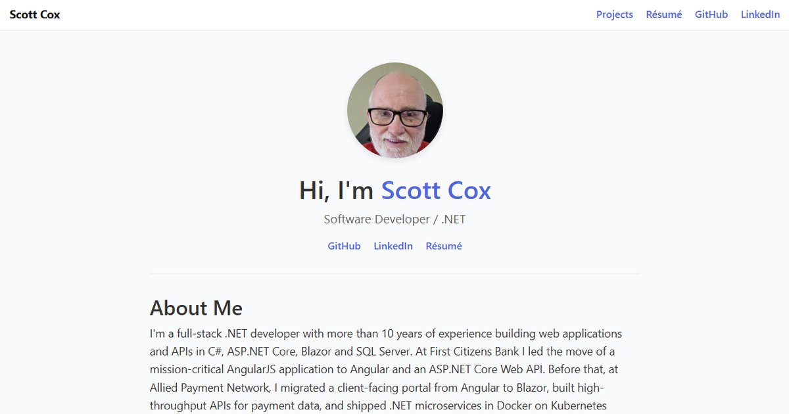

# Scott Cox · Developer Portfolio

[](https://github.com/scox115/portfolio-app-slc/actions/workflows/ci.yml)
[](https://github.com/scox115/portfolio-app-slc/actions/workflows/deploy.yml)
[](https://github.com/scox115/portfolio-app-slc/actions/workflows/uptime.yml)


My personal site: who I am, my résumé, and the projects I've built. It is a **Blazor Web App on .NET 10**, packaged as a container and hosted on **Azure Container Apps**, and every merge to `main` deploys itself through GitHub Actions.

**▶ Visit it: https://scottcoxdev.com**



## Featured project

**[Kings of the Card Arena](https://play.scottcoxdev.com)** ([source](https://github.com/scox115/gameappportfolio)) is a turn-based card battler with live PvP duels over SignalR, boss fights and a Gold Shop, built with Clean Architecture, ASP.NET Core, Blazor WebAssembly and EF Core on Azure.

## How it's built

| Area | How |
| --- | --- |
| **App** | Blazor Web App with server-side interactivity; pages are prerendered so search engines and link previews see real HTML ([ADR 0001](docs/adr/0001-blazor-web-app-on-container-apps.md)) |
| **Content** | Project cards come from [`wwwroot/data/projects.json`](wwwroot/data/projects.json), so adding a project means editing data, not markup ([ADR 0003](docs/adr/0003-projects-as-data.md)) |
| **Hosting** | A Docker image on Azure Container Apps, with HTTPS terminated at the ingress and forwarded headers trusted by the app |
| **Domain** | `scottcoxdev.com` and `www` bound to the Container App with free managed certificates ([ADR 0004](docs/adr/0004-custom-domain-managed-certificates.md)) |
| **CI/CD** | Pull requests must pass the `build` check; a green build on `main` triggers the deploy, which signs in to Azure with OIDC, so no Azure secret is stored in GitHub ([ADR 0002](docs/adr/0002-ci-then-deploy-with-oidc.md)) |
| **Monitoring** | A scheduled workflow checks the site every 30 minutes and opens a "Site down" issue if it fails ([ADR 0005](docs/adr/0005-uptime-check-in-github-actions.md)) |
| **Sharing** | Open Graph tags and a 1200×630 preview image on every page, so links look right on LinkedIn and in messages |

## Run it locally

You need the [.NET 10 SDK](https://dotnet.microsoft.com/download).

```powershell
dotnet run
```

Or with Docker:

```powershell
docker build -t portfolio-app-slc .
docker run -p 8080:8080 portfolio-app-slc
```

Then open http://localhost:8080.

## Add a project

Add an entry to [`wwwroot/data/projects.json`](wwwroot/data/projects.json):

```json
{
  "title": "My App",
  "description": "One sentence on what it is and how it's built.",
  "type": "Web App",
  "tags": [".NET", "Blazor"],
  "gitHubUrl": "https://github.com/scox115/my-app",
  "liveUrl": "https://my-app.example.com",
  "imageUrl": "images/projects/my-app.jpg"
}
```

`gitHubUrl`, `liveUrl` and `imageUrl` are optional. Images go in `wwwroot/images/projects/`, ideally 16:9. The tag filters on the home page are built from the tags you use.

## Write a blog post

Add a Markdown file to [`wwwroot/data/blog/`](wwwroot/data/blog/). The file name becomes the URL, so `2026-10-15-my-post.md` is served at `/blog/2026-10-15-my-post`. Start it with front matter:

```markdown
---
title: My post title
date: 2026-10-15
summary: One or two sentences for the Blog page and link previews.
tags: AI, .NET
image: /images/blog/my-post.jpg
imageAlt: What the cover image shows
---

The post, in Markdown.
```

`date` is required, and a post without it is skipped. `image` and `imageAlt` are optional and set the cover shown on the post's card and at the top of the post; 16:9 works best. Posts are listed newest first, and raw HTML in a post is not rendered. Images go in `wwwroot/images/blog/` and are linked as ``. A post goes live when its pull request is merged.

## Architecture Decision Records

The reasons behind the main choices are in [docs/adr](docs/adr/README.md).

## Contact

[LinkedIn](https://www.linkedin.com/in/scox115) · [GitHub](https://github.com/scox115)
